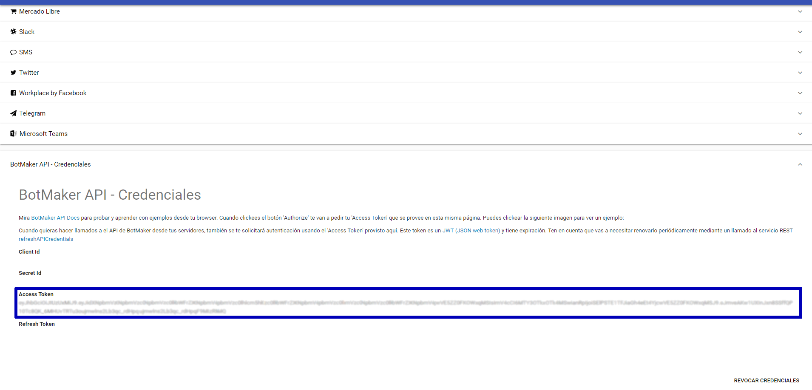

# Botmaker API
Botmaker te provee acceso a los datos de tu bot a través de su [API](https://go.botmaker.com/apidocs/).

## Acceso
  
Para poder acceder los métodos de la API y su especificación swagger debes seguir los siguientes pasos que te permitirán obtener un token de acceso.   
Para ellos debes:  
  
1. Accede a la **[configuración de canales](https://go.botmaker.com/#/platforms)**  
1. Selecciona **Botmaker API - Credenciales**  
1. Genera un token o utiliza el que ya está generado. En particular es importante que guardes el **Access Token**  
  


## Modelo de datos
### [Customer](https://go.botmaker.com/apidocs/#!/customer)

En el modelo de datos, un **customer** simboliza un usuario o cliente que interactúa con el bot. 
Todas las  interacciones por que se realicen en el mismo canal (Whastapp, Webchat, Messenger, Twitter, Google Assistant, etc.) seguirán haciendo referencia al mismo **customer**.

El **customer** se compone de los siguientes datos:

 - **BUSINESS_ID**: el id del bot al que pertenece el usuario. Para un mismo bot, todos los customers tendrán el mismo identificador.
 - **CREATION_TIME**: fecha de creación del customer, es decir, de su primera interacción.
 - **CHAT_PLATFORM_ID**: representa la plataforma por la cuál interactuó el usuario. Puede ser Whastapp, Webchat, Messenger, Twitter, Google Assistant, Microsoft Teams, etc.
 - **CHAT_CHANNEL_ID**: es el canal por el cuál interactuó el usuario en la plataforma. Es un id conformado por la plataforma + el id de canal.
 - **PLATFORM_CONTACT_ID**: id específico generado por la plataforma del canal utilizado. Junto con el id del canal permite identificar unívocamente al usuario.
 - **BOT_MUTED**: indica si el bot se encuentra apagado para este usuario. Cuando el bot está apagado no dará respuestas automáticas al usuario. El bot se enciende nuevamente a los 60 minutos de inactividad del usuario.
 - **PENDING_MSGS**: cantidad de mensajes que el bot no entendió y están pendientes de ser leídos por un agente humano.
 - **FIRST_NAME** y **LAST_NAME**: nombre y apellido del usuario respectivamente.
 - **LAST_SEEN**: fecha en qué el usuario habló por última vez.
 - **PICTURE_URL**: imagen del usuario en el canal al que pertenece.
 - **Variables**: el usuario también se compone de varaibles que son datos que se van obteniendo en las interacciones con el bot. 
Esos valores formaran parte del **customer** y figurarán en la API con el último valor que tuvieron. 
Las variables tienen un tipo (como en los lenguajes de programación) para acotar sus valores posibles y se pueden visualizar o modificar en la plataforma en la [sección de variables](https://go.botmaker.com/#/variables)
 - **Tags**:  son etiquetas que se aplican a un usuario para posterior identificación. El tag se puede considerar como una variable booleana (encendida o apagada).
 Un usuario posee un tag por las siguientes razones: 
		- El usuario habla sobre un tema específico en el bot, por lo que se tagea automáticamente con ese tema. 
		- Alguna regla o proceso del bot tagea específicamente al usuario para posterior visualización en métricas o generación de audiencias para envío de mensajes push. 

## /message/download
El objetivo de este endpoint es obtener la historia de mensajes del bot.
Cada llamado retorna 500 registros de mensajes, junto con el estado del usuario y operador humano al momento de enviarse el mensaje.
​
​
#### Modo de uso
El usuario tiene que llamar este servicio periódicamente, guardando los datos retornados en su propia base de datos,
para despues analizarlos como necesite. Cada pedido actualiza en la api la fecha del último mensaje descargado.
Cada nuevo llamado continua donde dejo el llamado anterior, sin necesidad de enviar un token de paginado.
(es por este cambio interno que este metodo es un POST).
​
La estructura del JSON devuelto es:
```
{
    hasMore: Boolean (si hay mas mensajes para pedir; usarlo como condicion de loop)
    messages: Lista de mensajes
    count: cantidad de mensajes
}
```
​
Estos son algunos de los campos de los objetos mensajes:
- id
- campos de tiempo: creation_time, message_date, message_year, message_month, message_week, message_day, message_quarter, message_dayofweek, message_time, message_hour, message_minute, message_second, message_day_name, message_semester, message_bimester
- msg_from, msg_to (`me` es un usuario y `bot` la plataforma)
- message
- chat_channel_id: el canal del mensaje (webchat, whatsApp, messenger, etc).
- datos del usuario: customer_id, customer_last_seen, customer_platform_contact_id, customer_first_name, customer_last_name, customer_email, customer_has_talked
- datos del usuario en el bot: campos uservar_*.
​
#### Ejemplo de invocacion
El siguiente es un ejemplo en node.js de cómo tiene que consumirse este servicio:
​
```
const rp = require('request-promise');
​
(async () => {
    let results = await rp.post(
        'https://go.botmaker.com/api/v1.0/message/download',
        { headers: { 'access-token': 'your-bot-access-token' }, json: true }
    );
​
    while (results.hasMore) {
        results = await rp.post(
            'https://go.botmaker.com/api/v1.0/message/download',
            { headers: { 'access-token': 'your-bot-access-token' }, json: true }
        );
        results.messages.forEach(message => saveInDB(message));
    }
​
    console.log('done!')
})();
```
​
#### Parametro fromDate
El parámetro _fromDate_ permite rebobinar el puntero interno para volver a pedir los datos en caso de error al guardarlos.
_fromDate_ puede ser como mínimo 1 semana anterior al momento actual.
