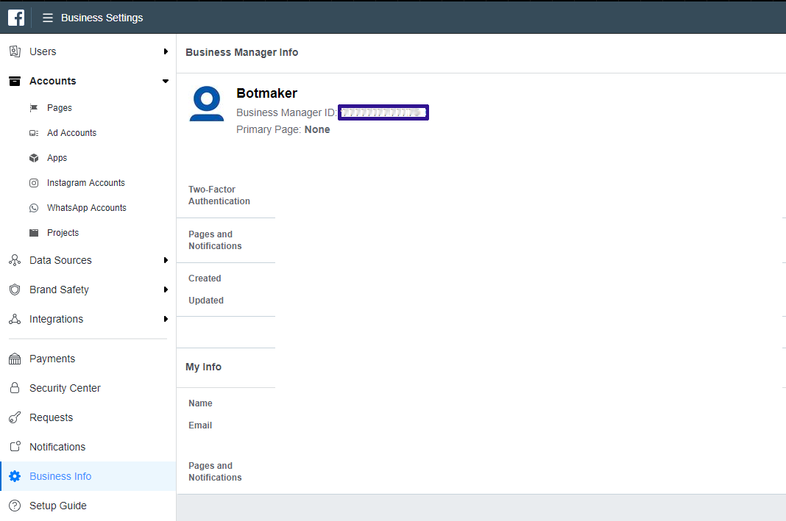

# Botmaker API para WhatsApp

Botmaker te provee acceso oficial para enviar y recibir mensajes de WhatsApp a más de 1500 millones de usuarios en el mundo. 

Puedes enviar mensajes sin programar y activando tu bot u operación manual utilizando la plataforma Botmaker y también acceder a Botmaker API 
para WhatsApp para conectar tus aplicaciones ahora mismo. 

**¡Solo te llevará 15 minutos!**

> Puedes probarlo ahora mismo **[aquí](whatsapp://send?phone=5491151234696&text=Hola!)** ó **[aquí](https://wa.me/5491151234696/?text=Hola!)** 

## Consideraciones iniciales

- El proceso de aprobación de tu cuenta se hace solo por única vez. Mientras eso sucede, puedas empezar ahora mismo a utilizar
nuestro **sandbox** para experimentar la experiencia y diseñar tu proceso de atención manual o automática.

- Una vez que te integres, hay dos formas de iniciar una conversación con tus usuarios:
  1. Los usuarios pueden iniciar la conversación con tu marca. Para ello puedes publicar tu número de WhatsApp en anuncions, sitios
  web e inclusive utilizar el url de auto activación: ```whatsapp://send?phone=tu_numero&text=Hola!``` o ```https://wa.me/tu_numero/?text=Hola!```
  1. También puedes contactar a los usuarios desde tu lado (sin que antes hayan chateado con tu empresa). _En este caso es
  importante que previamente hayas solicitado un opt-in por parte de ellos en tu website o mobile app. Por ejemplo un formulario
  de registración, email etc._

- WhatsApp proteje a sus usuarios contra prácticas de spam: tus usuarios pueden iniciar una conversación por cualquier motivo. 
En el caso de que tu los contactes deben ser por alguna de las siguientes razones aprobadas: Actualizaciones o alertas de cuenta, 
información de turnos/citas, novedades de alguna actividad generada previamente, novedeades en procesos de pagos, finanzas
personaes, novedades en reservas, en estado de envíos, cambios en tickets, novedades de transporte, etc.
No está permitido enviar mensajes de publicidad o venta.

- Para aprobar tu cuenta envia un email a **[servicio@botmaker.com](mailto:servicio@botmaker.com)** indicando:
 
  1. Tu **Business Manager Id** que puedes obtener en **[Facebook Business Manager](https://business.facebook.com/settings/info)**

  1. (si aun no tienes una cuenta, la puedes crear **[siguiendo estos pasos](https://www.facebook.com/business/help/1710077379203657)**

  1. El o los **números telefónicos** que quieras utilizar para tu cuenta de WhatsApp.
En general un solo número es suficiente pero puedes querer tener más para diferenciar idiomas (ej: línea Español, línea Portugués), ambientes 
(ej: Producción, QA) o países. 

> _Podemos proveerte números en Argentina y Brasil_

> _En caso de que quieras usar tus números, ten en cuenta que puedas utilizar números de teléfonos fijos. Si nos indicas un número de celular, 
este no debe haber tenido WhatsApp instalado en los últimos 6 meses_

- Información para el **perfil de la cuenta WhatsApp**
  1. Foto de perfil. Debe ser una imagen cuadrada de al menos 192×192 píxeles. Ten en cuenta que solo la part circular central 
  va a verse en la lista de contactos:
 
  1. Texto descriptivo del perfil para los campos _About_, _Dirección_, _Descripción del comercio_, _Categoría_, _email de contacto_ y _sitio web_

## Recibiendo mensajes de los usuarios

Los mensajes enviados por los usuarios se pueden ver instantaneamente en la **[Consola del Operador de Botmaker](https://go.botmaker.com)** donde
es posible contestar manualmente y mediante uso de bots. Sin embargo también es posible notificar a un sistema de estos mensajes.
Si quieres recibir cada mensaje que llega a la plataforma puedes configurar un _webhook_ en tus sistemas de lo siguiente manera:

- Accede a la **[Consola del Operador de Botmaker](https://go.botmaker.com)** y selecciona la opción Configuration, Configuraciones Internas ó accede directamente
a **[https://go.botmaker.com/#/adminconfig](https://go.botmaker.com/#/adminconfig)**
- Allí indica el URL de tu endpoint. Por ejemplo **https://example.com/income** 
- Tu endpoint debe contestar http code 200, tener un certificado válido https y estar disponible todo el tiempo y responder en menos de 2 segundos

 


## Enviando mensajes a los usuarios
(response es message id y % saldo pendiente)

### Cambios en el estado de los mensajes enviados

### Sandbox
(pregistered templates en sandbox)


