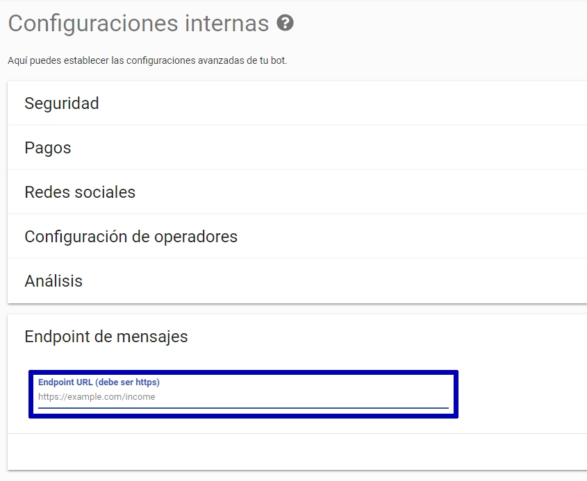
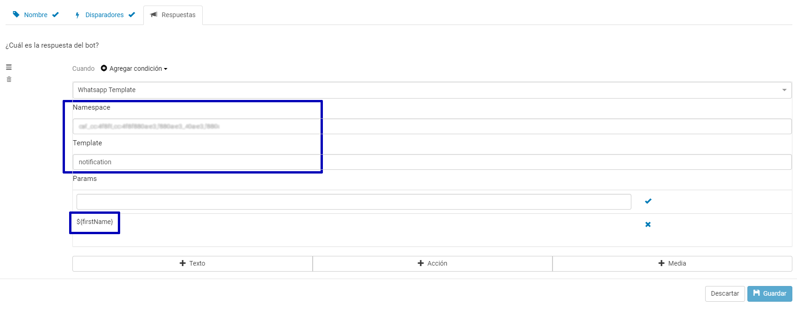

# Botmaker API para WhatsApp

Botmaker te provee acceso oficial para enviar y recibir mensajes de WhatsApp a más de 1500 millones de usuarios en el mundo. 

Puedes enviar mensajes sin programar y activando tu bot respondiendo tus mensajes manualmente utilizando la plataforma Botmaker y también acceder a Botmaker API 
para WhatsApp para conectar tus aplicaciones ahora mismo. 

**¡Solo te llevará 15 minutos!**

> Puedes probarlo ahora mismo **[aquí](whatsapp://send?phone=5491151234696&text=Hola!)** ó **[aquí](https://wa.me/5491151234696/?text=Hola!)** 


## Consideraciones iniciales

- El proceso de aprobación de tu cuenta se hace solo por única vez. Mientras eso sucede, puedas empezar ahora mismo a utilizar
nuestro **sandbox** para experimentar la experiencia y diseñar tu proceso de atención manual o automática.

- Una vez que te integres, hay dos formas de iniciar una conversación con tus usuarios:
  1. Los usuarios pueden iniciar la conversación con tu marca. Para ello puedes publicar tu número de WhatsApp en anuncions, sitios
  web e inclusive utilizar el url de auto activación: ```whatsapp://send?phone=tu_numero&text=Hola!``` o ```https://wa.me/tu_numero/?text=Hola!```
  1. También puedes contactar a los usuarios desde tu lado (sin que antes hayan chateado con tu empresa). _En este caso es
  importante que previamente hayas solicitado un opt-in por parte de ellos en tu website o mobile app. Por ejemplo un formulario
  de registración, email etc._

- WhatsApp proteje a sus usuarios contra prácticas de spam: tus usuarios pueden iniciar una conversación por cualquier motivo. 
En el caso de que tu los contactes deben ser por alguna de las siguientes razones aprobadas: Actualizaciones o alertas de cuenta, 
información de turnos/citas, novedades de alguna actividad generada previamente, novedeades en procesos de pagos, finanzas
personaes, novedades en reservas, en estado de envíos, cambios en tickets, novedades de transporte, etc.
No está permitido enviar mensajes de publicidad o venta.

- Para aprobar tu cuenta envia un email a **[servicio@botmaker.com](mailto:servicio@botmaker.com)** indicando:
 
  1. Tu **Business Manager Id** que puedes obtener en **[Facebook Business Manager](https://business.facebook.com/settings/info)**
  1. (si aun no tienes una cuenta, la puedes crear **[siguiendo estos pasos](https://www.facebook.com/business/help/1710077379203657)**
  1. El o los **números telefónicos** que quieras utilizar para tu cuenta de WhatsApp.
En general un solo número es suficiente pero puedes querer tener más para diferenciar idiomas (ej: línea Español, línea Portugués), ambientes 
(ej: Producción, QA) o países. 

> _Podemos proveerte números en Argentina y Brasil_

> _En caso de que quieras usar tus números, ten en cuenta que puedas utilizar números de teléfonos fijos. Si nos indicas un número de celular, 
este no debe haber tenido WhatsApp instalado en los últimos 6 meses_

- Información para el **perfil de la cuenta WhatsApp**
  - Foto de perfil. Debe ser una imagen cuadrada de al menos 192×192 píxeles. Ten en cuenta que solo la parte circular central va a verse en la lista de contactos:


 


  - Texto descriptivo del perfil para los campos _About_, _Dirección_, _Descripción del comercio_, _Categoría_, _email de contacto_ y _sitio web_


## Recibiendo mensajes de los usuarios

Los mensajes enviados por los usuarios se pueden ver instantaneamente en la **[Consola del Operador de Botmaker](https://go.botmaker.com)** donde
es posible contestar manualmente y mediante uso de bots. Sin embargo también es posible notificar a un sistema de estos mensajes.
Si quieres recibir cada mensaje que llega a la plataforma puedes configurar un _webhook_ en tus sistemas de lo siguiente manera:

- Accede a la **[Consola del Operador de Botmaker](https://go.botmaker.com)** y selecciona la opción Configuration, Configuraciones Internas ó accede directamente
a **[https://go.botmaker.com/#/adminconfig](https://go.botmaker.com/#/adminconfig)**
- Allí indica el URL de tu endpoint. Por ejemplo **https://example.com/income** 
- Tu endpoint debe contestar http code 200, tener un certificado válido https y estar disponible todo el tiempo y responder en menos de 10 segundos

 

- Una vez activado, vas a comenzar a recibir mensajes según las políticas de Google PubSub: mensajes firmados, preservación de mensajes por 7 días, etc.
Más detalles [aquí](https://cloud.google.com/pubsub/docs/push)

- El siguiente ejemplo muestra un mensaje típico de un usuario
```javascript
{
  "date": "2019-01-21T19:39:22.605Z",    // ISO 8601 for message time,
  "chatPlatform": "whatsapp",
  "contactId": "<user_phone>",           // User phone number, for instance 54911...
  "customerId": "<user_id>",             // User Id on botmaker
  "fromName": "<nickname_on_whatsapp>",
  "_id_": "<unique_message_id>",
  "message": "<optional_message_text>", // One of the following will be present
  "audio": "<optional_audio_url>",
  "video": "<optional_video_url>",
  "file": "<optional_file_url>",
  "image": "<optional_image_url>",
  "fromCustomer": true,                   // Is the message from the user or from 
  "WHATSAPP_NUMBER": "<botmaker_connected_whatsapp_line>",
}
```

Otros campos opcionales propios de la plataforma WhatsApp incluyen:
- Mensajes no soportados por la API
```
"error": "Unsupported message"
```
- Texto asociado a una imagen, video o archivo
```
"caption": "Photo title"
```
- Ubicación adjuntada en el mensaje
```
"location": {
    "address":"Main Street Beach, Santa Cruz, CA",
    "latitude":38.9806263495,
    "longitude":-131.9428612257,
    "name":"Main Street Beach"
}
```
- Información de contactos adjuntada en el mensaje
```
"contacts": [
    {
        "addresses": [
            {
                "city": "Menlo Park",
                "country": "United States",
                "country_code": "us",
                "state": "CA",
                "street": "1 Hacker Way",
                "type": "HOME",
                "zip": "94025"
            }
        ],
        "birthday": "2012-08-18",
        "emails": [
            {
                "email": "test@fb.com",
                "type": "WORK"
            },
            {
                "email": "test@whatsapp.com",
                "type": "WORK"
            }
        ],
        "name": {
            "first_name": "John",
            "formatted_name": "John Smith",
            "last_name": "Smith"
        },
        "org": {
            "company": "WhatsApp",
            "department": "Design",
            "title": "Manager"
        },
        "phones": [
            {
                "phone": "+1 (650) 555-1234",
                "type": "WORK",
                "wa_id": "16505551234"
            }
        ]
    }
] 
```

## Enviando mensajes a los usuarios

Es posible enviar mensajes a los usuarios utilizando la consola del operador, generando notificaciones masivas y programando envíos por diferentes estímulos. 
Y también se puede utilizar el API de Botmaker para disparar mensajes programáticamente desde un sistema.

Para ellos debes:

- Obtener un token para acceder el API
1. Accede a la **[configuración de canales](https://go.botmaker.com/#/platforms)**
1. Selecciona **Botmaker API - Credenciales**
1. Genera un token o utiliza el que ya está generado. En particular es importante que guardes el **Access Token**


- Con el access token, se puede efectuar el llamado via HTTP Post al API rest con un JSON:

```bash
curl -X POST --header 'Content-Type: application/json' --header 'Accept: application/json' --header 'access-token: your_access_token' -d '{"chatPlatform": "whatsapp", "chatChannelNumber": "your_phone", "platformContactId": "user_phone","messageText": "message_to_send"}' 'https://go.botmaker.com/api/v1.0/message/v3'

# your_access_token: ey...
# your_phone: +55135433...
# user_phone: +5512324314..
# message_to_send: Hi!
```

la respuesta va a ser un **http code 200** con un JSON indicando el id del mensaje generado:

```json
{
  "id": "id_del_mensaje"
}
```

> cada vez que un mensaje es enviado al usuario, se efectua un chequeo de control de saldo de tu cuenta Botmaker. Si la cuenta está cerca de quedar sin saldo, 
el servicio va a devolver un **http code 403 - Forbidden** indicando que no hay saldo para enviar mensajes en el JSON de respuesta 

```json
{
  "error": {
    "code": 101,
    "message": "Insufficient credit"
  }
}
```


### Templates messages

WhatsApp permite enviar mensajes a usuarios hasta 24 horas después del último mensaje producido por este. Fuera de ese rango, los mensajes deben ser enviados
utilizando el endpoint **intent** y realizando los siguientes pasos:

- Ingresar a **[Message Templates en Facebook Business Manager](https://business.facebook.com/wa/manage/message-templates/)**

- Anotar el **namespace**, **templates** y sus **parámetros** (si los usa)

- Luego ingresar a **[Configuración de Reglas](https://go.botmaker.com/#/rule)**

- Crear una nueva regla, es importante anotar el nombre de esa regla para los próximos pasos

- En el tab **Respuestas** crear una nueva acción **"WhatsApp Template"**



- Allí anotar **namespace**, **templates** y sus **parámetros**.

- Finalmente efectuar la llamada al endpoint:


```bash
curl -X POST --header 'Content-Type: application/json' --header 'Accept: application/json' --header 'access-token: your_token' -d '{"chatPlatform": "whatsapp", "chatChannelNumber": "your_phone_number", "platformContactId": "user_phone_number", "ruleNameOrId": "rule_name", "params": {"my_template_var":"var_value"}}' 'https://go.botmaker.com/api/v1.0/intent/v2'

# your_token: your access token
# your_phone_number: whatsapp number of yours
# user_phone_number: whatsapp number of user
# rule_name: botmaker rule name
```


### Mensajes multimedia

Botmaker permite enviar todos los tipos de mensajes multimedia soportados por WhatsApp y otros canales. Para ello deber crear un mensaje desde Reglas
siguiendo la información de **[Como crear respuestas](https://botmakeradmin.github.io/docs/es/#/como-crear-una-regla?id=respuestas)** en nueva nueva Regla.

Luego puedes llamar al servicio de activación de reglas desde tu sistema. Por ejemplo:

```bash
 curl -X POST --header 'Content-Type: application/json' --header 'Accept: application/json' --header 'access-token: your_token' -d '{"chatPlatform": "whatsapp", "chatChannelNumber": "your_phone_number", "platformContactId": "user_phone_number", "ruleNameOrId": "rule_name", "params": {"param_key_1":"param_value_1"}}' 'https://go.botmaker.com/api/v1.0/intent/v2'

# your_token: your access token
# your_phone_number: whatsapp number of yours
# user_phone_number: whatsapp number of user
# rule_name: botmaker rule name
```

Alternativamente se puede usar el servicio normal de mensajería y especificar la URL del archivo de media que se quiere envíar

```bash
curl -X POST --header 'Content-Type: application/json' --header 'Accept: application/json' --header 'access-token: your_access_token' -d '{"chatPlatform": "whatsapp", "chatChannelNumber": "your_phone", "platformContactId": "user_phone", "messageText": "file_caption", "audioURL": "audio_to_send", "imageURL": "image_to_send", "fileURL", "file_to_send"}' 'https://go.botmaker.com/api/v1.0/message/v3'

# your_access_token: ey...
# your_phone: +55135433...
# user_phone: +5512324314..
# file_caption: a text description next to the file
# audio_to_send: https://....my_audio.mp3  
# image_to_send: https://....my_photo.jpeg
# file_to_send: https://....my_file.pdf
```

Puedes elegir uno o varios de los tipos de media para enviar en un mensaje. [Aquí](https://developers.facebook.com/docs/whatsapp/api/media#supported-files) hay una lista de formato de archivo válidos. Por el momento WhatsApp no tiene soporte de video. 

### Cambios en el estado de los mensajes enviados

Posteriormente a enviar un mensaje a un usuario, tu endpoint va a recibir notificaciones de entrega o lectura del mensaje enviado por ti.

1. **delivered** indica que el mensaje ha sido enviado (doble tilde de WhatsApp) 
1. **read** indica que el mensaje ha sido leído por el usuario destino (doble tilde azul de WhatsApp) 

```javascript
{
  "CHAT_PLATFORM_ID": "message_platform", // for instance whatsapp 
  "CREATION_TIME": "a_date",              // ISO 8601 for message time, for instance 2018-09-03T14:30:24.578Z
  "CUSTOMER_ID": "user_id",               // unique id of user
  "_id_": "message_id",                   // unique id of message
  "FROM": "phone_number",                 // user phone number
  "STATUS": "el_cambio_status"            // message read or delivered
}
```

> si un usuario desactiva esta opción desde su configuración de privacidad, estos mensajes no va a ser recibidos.

### Chequear validez de números de contactos de WhatsApp

Es posible verificar si un número de teléfono es válido para WhatsApp, y alternativamente obtener el formato adecuado de ese número.

El endpoint para verificar es el siguiente:

```bash
curl -X POST --header 'Content-Type: application/json' --header 'Accept: application/json' --header 'access-token: your_token' -d '{"chatChannelNumber": "your_phone_number", "contacts": ["user_phone"]}' 'https://go.botmaker.com/api/v1.0/customer/checkWhatsAppContact'

# your_token: your access token
# your_phone_number: whatsapp number of yours
# contacts: an array of users phones
```


### Aplicar formato a mensajes desde API

Se puede aplicar formato simples a textos de mensajes que se envían a los usuarios. "Hola _Juan_". Para más información revisar la 
**[documentación de formato de WhatsApp](https://faq.whatsapp.com/en/android/26000002/)**
